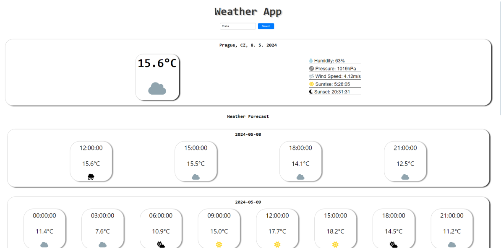

# Weather App

Jednoduchá webová aplikace pro zobrazení aktuálního počasí a předpovědi počasí pro vybrané město.

## Funkce

- **Aktuální počasí:** Zobrazuje aktuální teplotu, vlhkost, tlak a rychlost větru.
- **Předpověď počasí:** Zobrazuje předpověď počasí na následujících dní.
- **Grafická reprezentace:** K dispozici jsou ikony pro různé typy počasí.
- **Vyhledávání:** Možnost vyhledat počasí pro libovolné město.

## Použité technologie

- **React:** Frontendový framework pro vytváření uživatelských rozhraní.
- **axios:** Knihovna pro snadné provádění HTTP požadavků.
- **OpenWeatherMap API:** API pro získávání aktuálního počasí a předpovědi počasí.

## Použití

1. **Instalace závislostí:**
   
   ```
   npm install
   ```

2. **Spuštění aplikace:**
   
   ```
   npm start
   ```

3. **Otevření aplikace:**

   Otevřete prohlížeč a přejděte na adresu `http://localhost:3000`.

## Ukázka


*Tento obrázek zobrazuje ukázku mojí aplikace zobrazující aktuální počasí a předpověď počasí.*

## Licence

Tento projekt je licencován pod [MIT licencí](LICENSE).
